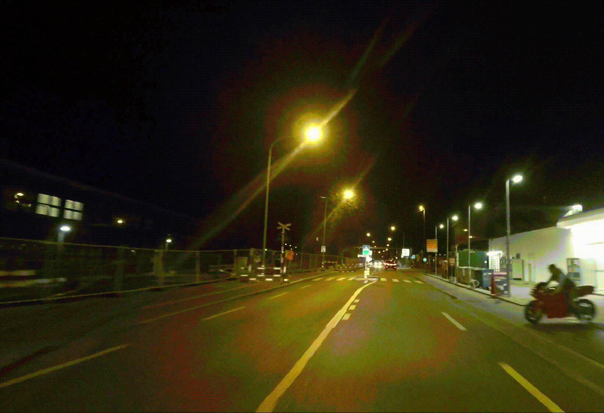

# Vanishing-Point-Guided Video Semantic Segmentation of Driving Scenes (CVPR2024)
> [Paper](https://arxiv.org/pdf/2401.15261.pdf)
> 
> Authors:
> [Diandian Guo](https://www.linkedin.com/in/diandian-guo-062000228/), 
> [Deng-Ping Fan](https://dengpingfan.github.io/),
> [Tongyu Lu](https://lucainiaoge.github.io/),
> [Christos Sakaridis](https://people.ee.ethz.ch/~csakarid/), 
> [Luc Van Gool](https://ee.ethz.ch/the-department/faculty/professors/person-detail.OTAyMzM=.TGlzdC80MTEsMTA1ODA0MjU5.html).
>
## 1. Vanishing-Point Guided
The estimation of implicit cross-frame correspondences and the high computational cost have long been major challenges in video semantic segmentation (VSS) for driving scenes. 
Prior works utilize keyframes, feature propagation, or cross-frame attention to address these issues.
By contrast, we are the first to harness vanishing point (VP) priors for more effective segmentation. The comparisons between different SOTA methods are shown in the following figure.
<p align="center">
     <br />
    <em> 
    Figure 1: Qualitative comparison on ACDC. The yellow box represents the densely partitioned VP region. Our model produces more accurate results for both distant tiny hard samples near the VP and occluded fast-moving close targets.
    </em>
</p>

|            *VPSeg-Sample_1*        |             *VPSeg-Sample_2*        |
| :------------------------------: | :-------------------------------: |
|  |   |


## 2. Visualization
Visualization of detail attention maps O with N motion attention layers in CMA. As N increases, the detail attention map interacts more heavily with the dynamic features, and the weights gradually decrease in closer parts of the scene or on simple semantic categories. The highlighted distant regions near the VP suggest that the final predictions P_f are primarily based on the detail-based predictions P_d and not on P_c for these regions. The VP proximity map serves as a positional prior and assists the model in pinpointing the locations of these distant regions.
<p align="center">
     <br />
</p>

## 3. Quantitative Results
The results for various methods are shown below.
| Method           | Publication | Backbone | Params(M)| mIoU (A.)| mIoU (C.) | miIoU(A.)| miIoU(C.)| mIA-IoU  |    VSS   |
|------------------|:-----------:|:--------:|:--------:|:--------:|:---------:|:--------:|:--------:|:--------:|:--------:|
| DeepLabv3+       |   ECCV'18   | ResNet-101  |  62.7   |  72.79  |  79.09  |  43.14  |   56.89  |  36.32  |  &cross; |
| PSPNet           |   CVPR'17   | ResNet-101  |  68.0   |  72.26  |  78.34  |  40.95  |   56.78  |  37.29  |  &cross; |
| OCRNet           |   ECCV'20   | ResNet-101  |  55.6   |  70.39  |  80.09  |  43.36  |   59.55  |  33.38  |  &cross; |
| SeaFormer        |   ICLR'23   | SeaFormer-L |  14.0   |  70.09  |  77.70  |  40.41  |   56.96  |  33.26  |  &cross; |
| SegFormer        |   NIPS'21   |   MiT-B1    |  13.7   |  70.25  |  78.56  |  41.14  |   58.25  |  34.05  |  &cross; |
| SegFormer        |   NIPS'21   |   MiT-B3    |  44.6   |  75.38  |  81.32  |  46.51  |   60.01  |  38.42  |  &cross; |
| Video K-Net      |   CVPR'22   |   Swin-B    |  104.6  |  69.03  |  76.62  |  39.33  |   56.02  |  31.67  |  &check; |
| ETC              |   ECCV'20   | ResNet-101  |  68,1   |  71.45  |  79.50  |  42.28  |   58.35  |  36.71  |  &check; |
| TCB              |   CVPR'21   | ResNet-101  |  72.5   |  70.56  |  78.70  |  41.76  |   57.84  |  35.96  |  &check; |
| NetWarp          |   ICCV'17   |   PSPNet    |  90.6   |  73.71  |  80.60  |  45.59  |   59.63  |  36.58  |  &check; |
| CFFM             |   CVPR'22   |   MiT-B3    |  49.6   |  75.47  |  81.44  |  47.31  |   60.09  |  37.88  |  &check; |
| MRCFA            |   ECCV'22   |   MiT-B3    |  48.2   |  75.63  |  81.31  |  46.28  |   60.56  |  38.81  |  &check; |
| VPSeg (Ours)     |   CVPR'24   |   MiT-B1    |  14.9   |  72.86  |  79.56  |  43.42  |   59.53  |  37.96  |  &check; |
| VPSeg (Ours)     |   CVPR'24   |   MiT-B3    |  46.8   |  77.48  |  82.46  |  49.42  |   61.79  |  41.48  |  &check; |

## 4. Citations
```bibtex
@inproceedings{guo2024vpseg,
    title={Vanishing-Point-Guided Video Semantic Segmentation of Driving Scenes},
    author={Diandian Guo and Fan, Deng-Ping and Tongyu Lu and Sakaridis, Christos and Van Gool, Luc},
    booktitle={Proceedings of the IEEE/CVF International Conference on Computer Vision and Patern Recognition (CVPR)},
    year={2024}
}
```
## 5. Contact
- Diandian Guo, guodiandian1998@gmail.com
